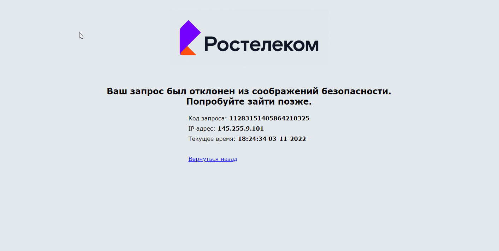

# Module_28

Файл test_authorization - Стандартная авторизация по логину и паролю:
проверка главной страницы выявила неверное расположение блоков левой и правой части,
в меню выбора авторизации текст не "Номер", а "Телефон", отсутствует продуктовый
слоган ЛК "Ростелеком ID" и вспомогательная информация для клиента.
Не возможно выполнить проверку на положительный тест авторизации по "Логину" и 
"Лицевому счету" они должны быть при регистрации их не нет.
Система не отображает форму «Авторизация по коду». 

Файл test_password_recovery - восстановление пароля по номеру телефона и
восстановление пароля по почте, тесты остановлены на вводе 
"Капчи" -  которую победить как. 

Файл test_registration - регистрация нового пользователя - тесты недописаны: 
1. Ввод: Имя Фамилия  латиницей кирилицей количество символов меньше двух,
больше двух, знак тире.
2. Выбрать регион - (не знаю как реализовать)
3. Ввод почты используя вертуальный почтовый ящик с проверкой письма и ввода кода. 
 Ввод телефона с проверкой кода (не знаю как реализовать)
4. Ввод пароля - варианты в требованиях.

Файл base.py и elements.py использованы без изменения с 
https://github.com/ptaschka/28-Module_Final.git